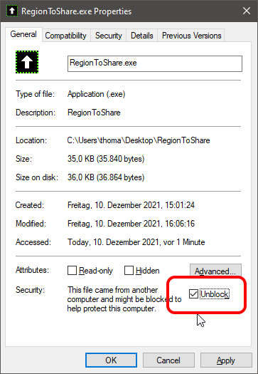

#  Region to Share 

A helper app to share only a part of a screen via video conference apps that only support either full screen or single window like e.g. Teams, WebEx, etc.

## Installation

- Download the archive with latest binaries from the [Releases](./releases).  
- Unpack the files to a location of your choice.
- If you have used Windows Explorer to unpack the archive, unblock the app:
  - Right click the .exe and select properites
  - Check "Unblock" 

## Usage

- Start RegionToShare.exe.
- Move it to the region you want to share.
- In your meeting app start sharing the window "Region to Share".

- Now click the "Region to Share" window to start sharing the selected region. 
  The window will change to the region selection frame, and others are seeing what's inside this frame.
- Close the region frame to stop showing the region without stopping to share.

