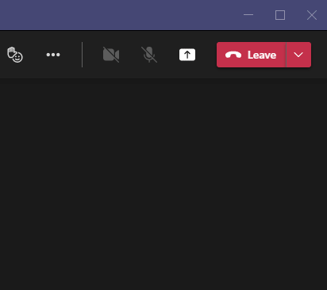
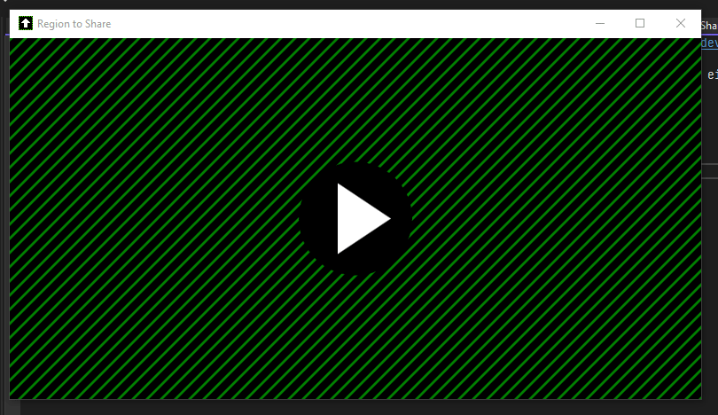

#  Region to Share 

A Windows helper app to share only a part of a screen via video conference apps that only support either full screen or single window like e.g. Teams, WebEx, etc.

## How it works
This tool simply mirrors the content of a screen region into a hidden window. In your meeting app you then can just share the content of this hidden window. 

**Region to Share is not aware of your meeting app nor what the meeting app is doing with the content of the window.** 
It's up to your meeting app whether it properly shares this hidden windows content or not - there is nothing Region to Share can do about this.

## Prerequisites
- Windows 10 or 11
- DotNet 4.6.2 or newer

## Installation

- Download and install this app from the [Windows Store](https://www.microsoft.com/store/productId/9N4066W2R5Q4)
  or pick the latest binariers from the [release page](https://github.com/tom-englert/RegionToShare/releases) 

## Usage

- Start the "RegionToShare" app.
- Move the window to the region you want to share.
- In your meeting app start sharing the window "Region to Share".

- Now click the "Region to Share" window to start sharing the selected region. 
  The window will change to the region selection frame, and others are seeing what's inside this frame.
- Close the region frame to stop showing the region without stopping to share.

## Feedback 😄
If you like this tool, don't forget to ⭐ it. 
